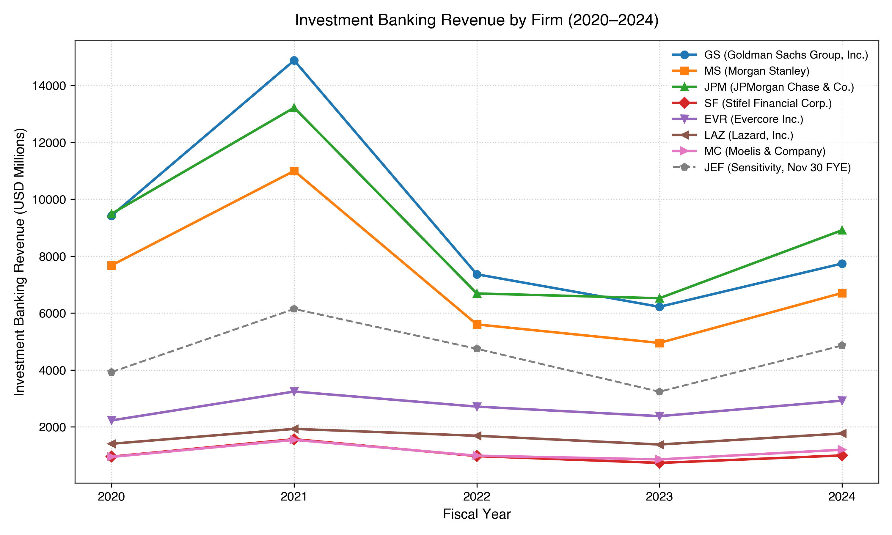
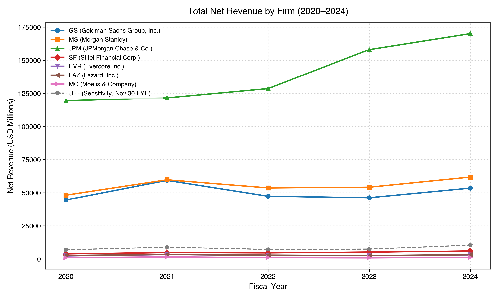
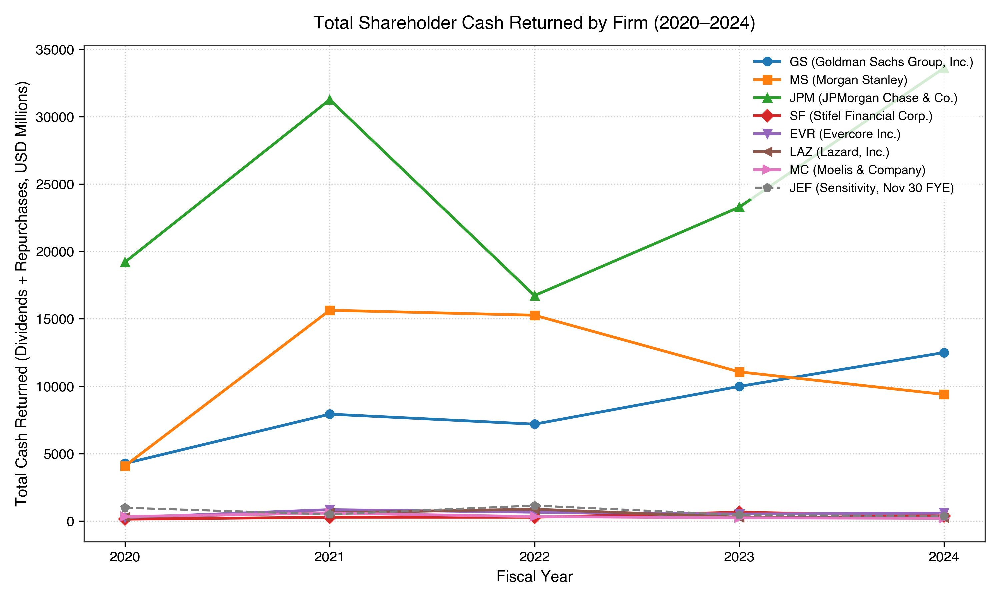
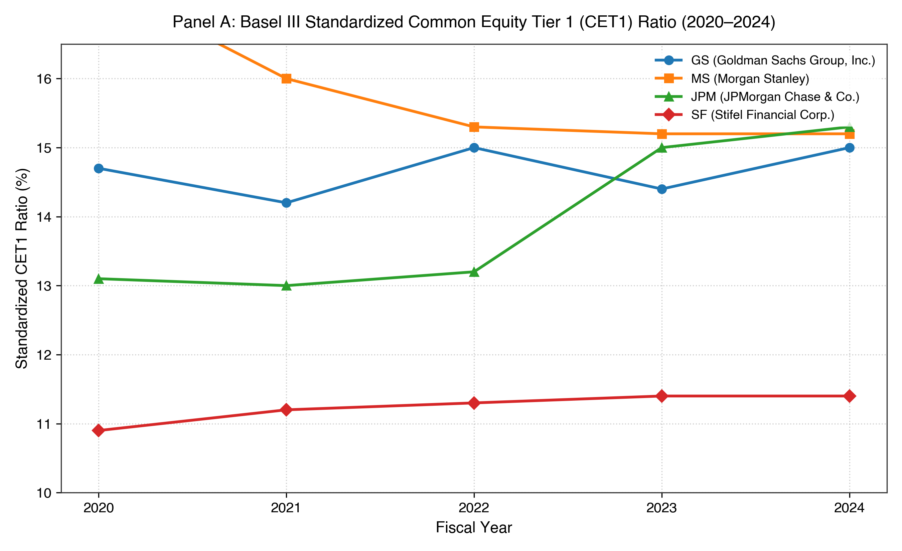
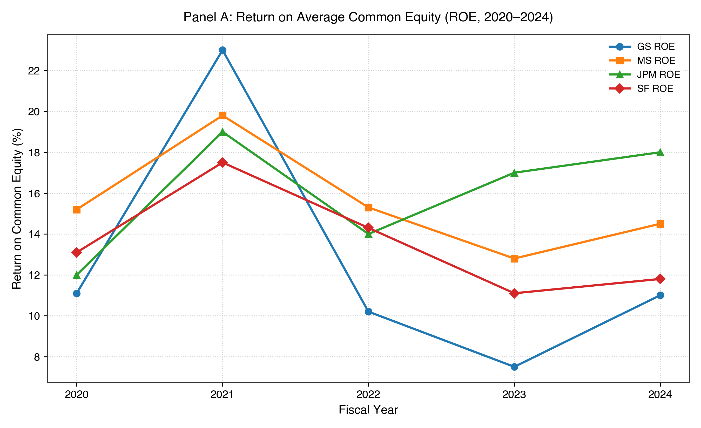
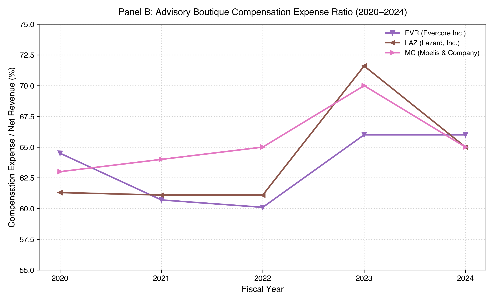
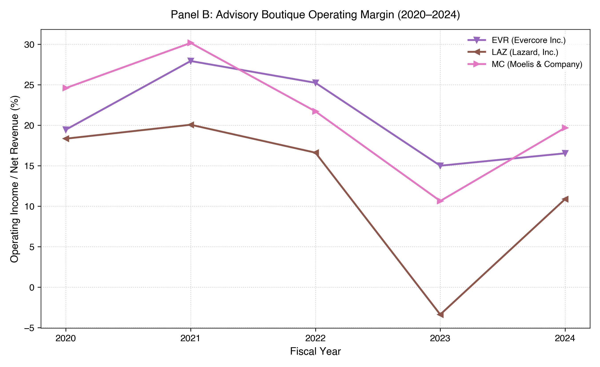
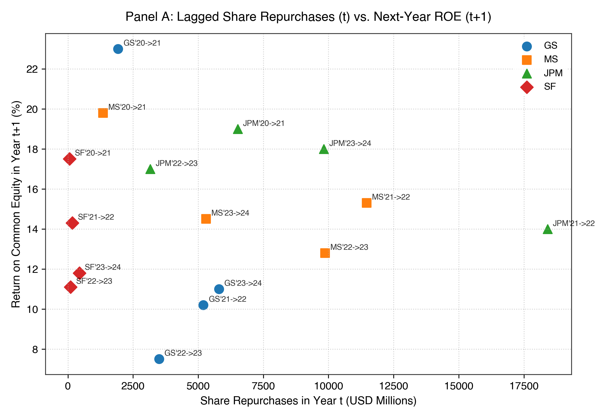
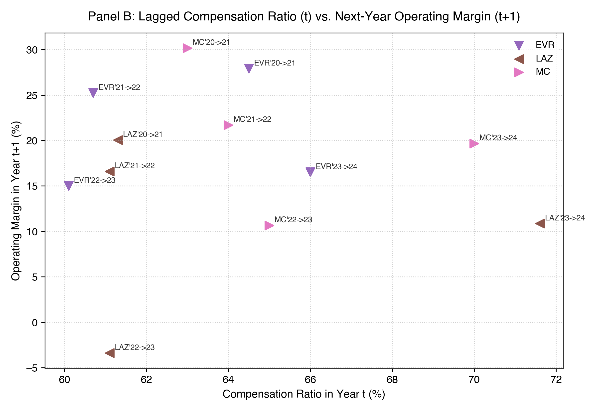

# Strategic Capital Allocation in Investment Banking: A Comparative Longitudinal Study of Major U.S. Firms, 2020–2024

**Author**: Ege Can  
**Academic Level**: Independent High-School Student Research Project  
**School**: FMV Özel Ispartakule Işık High School, Istanbul (Class of 2027)  
**Date**: September 2026  
**Research Method**: Observational, Longitudinal, Comparative Financial Analysis  
**Primary Data Source**: Official SEC Form 10-K Filings (U.S. Securities and Exchange Commission)  

---

## 1. Abstract

This independent research paper examines how major U.S. investment-banking and financial advisory firms allocated capital between business investment, balance-sheet retention, and shareholder distributions over the five-year period from 2020 through 2024, and how these allocation patterns were associated with subsequent business performance. The study investigates an eight-firm candidate universe structured into two distinct panels: Panel A consists of four large bank holding companies (Goldman Sachs, Morgan Stanley, JPMorgan Chase, and Stifel Financial), and Panel B consists of three independent advisory boutiques (Evercore, Lazard, and Moelis & Company), with Jefferies Financial Group evaluated separately as a broker-dealer sensitivity context. Audited financial data comprising 540 raw observations and 70 derived records were hand-collected across 40 primary SEC Form 10-K filings. 

Descriptive findings reveal that the eight firms returned an aggregate of $233.2 billion to shareholders ($113.8 billion in cash dividends and $119.3 billion in share repurchases). Across all firms, cash dividends functioned as a comparatively stable or increasing payout component, while share repurchases exhibited wide year-to-year variation that coincided with cyclical revenue shifts. For Goldman Sachs, Morgan Stanley, and JPMorgan Chase, reported standardized CET1 ratios ranged from 13.1% to 17.4% during 2020–2024. Stifel Financial reported a five-year average CET1 ratio of 11.24% under its Category IV framework. In contrast, advisory boutique compensation expense ratios increased from 60.1%–64.0% during the 2021 market peak to 66.0%–71.6% during the 2023 revenue contraction, coinciding with operating margin compression from 20%–28% down to 5.1%–15.0%. 

In an exploratory one-year lagged analysis ($t \to t+1$), the two panels displayed divergent empirical relationship patterns: Panel A showed a near-zero linear association between prior-year share repurchases and next-year return on common equity (Pearson $r = -0.049$, $p = 0.858$; Spearman $\rho = -0.035$, $p = 0.897$, $N = 16$), whereas Panel B showed a negative association between prior-year repurchases and next-year operating margins (Pearson $r = -0.403$, $p = 0.194$; Spearman $\rho = -0.385$, $p = 0.217$, $N = 12$). The author's central interpretation is that financial outputs may reflect the interaction between financial conditions and the mechanisms through which firms make capital-allocation decisions. Because organizational structures, regulatory constraints, and balance-sheet characteristics differ fundamentally across business models, similar financial variables should not be assumed to carry identical economic meanings across different firm types. The primary limitations of the study include small lagged sample sizes ($N = 12$ to $16$), a five-year observational horizon capturing a unique macroeconomic cycle, and the absence of direct data on executive decision-making. No causal claims are asserted.

---

## 2. Introduction

Capital allocation—the process by which corporate leadership decides how to deploy net revenues between reinvestment in the business, balance-sheet capital retention, and shareholder distributions—is one of the most consequential functions in corporate finance. How capital is allocated determines a firm's solvency buffer against unexpected losses, shapes its capacity to invest in human and technological capabilities, and dictates the volume of cash returned to equity holders.

The investment-banking and financial advisory industry provides an especially compelling setting for studying capital allocation. Between 2020 and 2024, the sector experienced an extraordinary sequence of macroeconomic and financial shocks:
1. In 2020, the sudden onset of the COVID-19 pandemic introduced acute market uncertainty, prompting emergency fiscal stimulus and unprecedented Federal Reserve monetary interventions.
2. In 2021, an unprecedented global surge in mergers and acquisitions (M&A), initial public offerings (IPOs), and debt financing generated record fee revenues across Wall Street.
3. In 2022 and 2023, rapid monetary policy tightening—characterized by over 500 basis points of Federal Reserve interest-rate increases—sharply curtailed global capital-markets underwriting and advisory activity.
4. In 2024, market activity began a gradual recovery, accompanied by changing regulatory debates surrounding the proposed Basel III Endgame capital revisions.

Despite operating within the same broad sector, firms that provide investment-banking and financial advisory services do not share identical corporate structures. Some operate as massive, balance-sheet-intensive universal bank holding companies (BHCs) that take deposits, extend commercial loans, finance multi-hundred-billion-dollar trading inventories, and maintain regulatory capital buffers under Federal Reserve supervision. Others operate as asset-light advisory boutiques that specialize strictly in strategic advisory assignments, maintain zero commercial loan portfolios or deposit bases, and rely primarily on professional talent rather than balance-sheet leverage.

Comparing capital allocation across these distinct organizational forms requires caution. A capital-allocation metric that appears straightforward on a corporate income statement—such as dollars returned through share repurchases or capital retained on the balance sheet—may perform fundamentally different economic roles depending on whether it is executed by a bank holding company subject to strict regulatory solvency mandates or by an advisory boutique managing cash liquidity against deal-flow volatility.

This study investigates this comparative setting through a structured empirical inquiry. Specifically, the paper addresses the following primary research question:

> **Primary Research Question**:  
> *How do major investment-banking firms allocate capital between business investment, capital retention, and shareholder distributions, and how are these patterns associated with subsequent business performance?*

To maintain analytical discipline, this investigation is structured as an **observational, longitudinal, and comparative study**. It does not attempt to prove causation or run complex econometric regressions. Rather, its objective is to document what primary SEC filings actually show, analyze how capital decisions differ across business models, and present a student framework for understanding the results.

---

## 3. Research Questions and Conceptual Framework

To evaluate the primary research question, the study investigates three interrelated sub-questions:
1. **Longitudinal Distribution Patterns**: How did regular cash dividends and common share repurchases behave over the 2020–2024 cycle, and to what extent did payout channels vary across market regimes?
2. **Capital Bounds and Operating Flexibility**: How did regulatory capital requirements bound bank holding company balance sheets, and how did advisory boutique expense structures (specifically compensation ratios) adjust during industry downturns?
3. **Exploratory Lagged Associations**: How were capital-allocation decisions in year $t$ associated with operating performance in year $t+1$, and did these relationships differ across business models?

### Student Conceptual Framework: Understanding Capital Allocation

To interpret the connection between observable financial figures and the external macroeconomic environment, I formulated the following conceptual chain:

```
+-------------------------------------------------------------+
|                     FINANCIAL CONDITIONS                    |
|   (Macro deal cycles, interest rates, regulatory rules,     |
|              market volatility, fee revenue)                |
+-------------------------------------------------------------+
                              |
                              v
+-------------------------------------------------------------+
|          POSSIBLE DECISION-MAKING CONSIDERATIONS            |
|   (Unobserved factors: risk tolerance, talent retention,    |
|      balance-sheet considerations, liquidity needs, etc.)   |
+-------------------------------------------------------------+
                              |
                              v
+-------------------------------------------------------------+
|                 CAPITAL-ALLOCATION DECISIONS                |
|   (Setting dividend rates, executing share repurchases,     |
|      allocating compensation pools, retaining capital)      |
+-------------------------------------------------------------+
                              |
                              v
+-------------------------------------------------------------+
|                  OBSERVABLE FINANCIAL OUTPUTS               |
|      (Cash dividends paid, common share buybacks, CET1,     |
|      compensation ratios, operating margins, ROE)           |
+-------------------------------------------------------------+
```

### Distinguishing Recorded Financial Facts from Student Interpretation

It is vital to state clearly what this framework is and what it is not:
- **It is my analytical perspective**: It provides a conceptual structure for thinking about how financial outputs relate to external conditions through the lens of organizational decision-making.
- **It is NOT an empirically measured causal mechanism**: The dataset collected in this study observes **financial conditions** (such as interest rates and revenues) and **observable financial outputs** (such as dividends paid, shares repurchased, reported CET1 ratios, and operating margins).
- **Unobserved internal processes**: The SEC Form 10-K filings used as primary sources record financial amounts; they do not record boardroom deliberations, executive strategy sessions, management risk preferences, or internal debates. 

Therefore, any reference to firm decision-making in this paper is treated as a possible connecting link and an interpretive perspective, not as a proven empirical fact.

---

## 4. Research Design

### 4.1 Firm Selection
The candidate universe was constructed to evaluate major U.S. investment-banking and advisory organizations that maintained continuous, audited reporting under U.S. GAAP across the entire 2020–2024 period. Eight firms were identified and classified based on their primary operational profile.

### 4.2 Panel Construction
Because combining diverse financial institutions into a single pooled sample would mask structural distinctions, the study implements a locked two-panel architecture alongside one sensitivity firm:

1. **Panel A (Bank Holding Companies)**:
   - **The Goldman Sachs Group, Inc. (`GS`)**: Global bank holding company and Category I Global Systemically Important Bank (G-SIB), with major operations in investment banking, global markets, and asset & wealth management.
   - **Morgan Stanley (`MS`)**: Global bank holding company and Category I G-SIB, with substantial operations in wealth management, institutional securities, and investment banking.
   - **JPMorgan Chase & Co. (`JPM`)**: Largest U.S. bank holding company and Category I G-SIB, operating across consumer & community banking, commercial banking, asset management, and corporate & investment banking.
   - **Stifel Financial Corp. (`SF`)**: Financial holding company operating as a Category IV banking organization, combining mid-market investment banking with a sizable retail wealth-management network.

2. **Panel B (Independent Advisory Boutiques)**:
   - **Evercore Inc. (`EVR`)**: Premier independent investment-banking advisory boutique, specializing in strategic M&A advice, capital-raising advisory, and restructuring.
   - **Lazard, Inc. (`LAZ`)**: Global financial advisory and asset management firm with corporate origins dating to 1848, converting to a U.S. C-Corporation in 2024.
   - **Moelis & Company (`MC`)**: Pure-play independent global financial advisory boutique founded in 2007, operating across M&A, recapitalizations, and restructuring.

3. **Sensitivity / Context Comparison**:
   - **Jefferies Financial Group Inc. (`JEF`)**: Full-service investment bank and broker-dealer. Jefferies is analyzed separately because of its non-standard fiscal year-end (November 30) and its regulatory status under SEC broker-dealer capital rules rather than Federal Reserve bank holding company supervision.

```
+----------------------------------------------------------------------------------------------------+
|                                    TABLE 1: FIRM AND PANEL OVERVIEW                                |
+--------+---------------------------------+-------------+------------------------------+------------+
| Ticker | Full Entity Name                | Research    | Business Model               | Fiscal     |
|        |                                 | Panel       | Classification               | Year-End   |
+--------+---------------------------------+-------------+------------------------------+------------+
| GS     | The Goldman Sachs Group, Inc.   | Panel A     | Bank Holding Company / G-SIB | Dec 31     |
| MS     | Morgan Stanley                  | Panel A     | Bank Holding Company / G-SIB | Dec 31     |
| JPM    | JPMorgan Chase & Co.            | Panel A     | Bank Holding Company / G-SIB | Dec 31     |
| SF     | Stifel Financial Corp.          | Panel A     | Financial Holding Company    | Dec 31     |
| EVR    | Evercore Inc.                   | Panel B     | Independent Advisory Boutique| Dec 31     |
| LAZ    | Lazard, Inc.                    | Panel B     | Advisory & Asset Management  | Dec 31     |
| MC     | Moelis & Company                | Panel B     | Pure Independent Advisory    | Dec 31     |
| JEF    | Jefferies Financial Group Inc.  | SENSITIVITY | Broker-Dealer / Inv. Bank    | Nov 30     |
+--------+---------------------------------+-------------+------------------------------+------------+
```

### 4.3 Study Period
The study covers five full fiscal years (2020, 2021, 2022, 2023, and 2024). This multi-year horizon spans four discrete annual transitions:
- Transition 1: $2020 \to 2021$ (COVID shock to historic liquidity and deal boom)
- Transition 2: $2021 \to 2022$ (Peak market activity to aggressive Federal Reserve rate tightening)
- Transition 3: $2022 \to 2023$ (Prolonged underwriting drought and banking stress)
- Transition 4: $2023 \to 2024$ (Initial market recovery and advisory stabilization)

### 4.4 Observational Design
The analysis utilizes two complementary methodologies:
1. **Longitudinal Descriptive Analysis**: Tracking levels, within-firm absolute changes ($\Delta$), and percentage changes ($\%\Delta$) for revenue, shareholder distributions, balance-sheet capital, and operating margins.
2. **Exploratory One-Year Lagged Analysis ($t \to t+1$)**: Assessing how capital allocation choices in year $t$ relate to performance in year $t+1$. Bivariate linear associations are measured using both **Pearson product-moment correlation coefficients ($r$)** and **Spearman rank-order correlation coefficients ($\\rho$)**. Pearson and Spearman correlations were both reported as complementary measures of association.

### 4.5 Variable Structure
Variables were chosen to capture the core dimensions of strategic capital allocation:
- **Top-Line Scale**: Net Revenues ($M)
- **Sector Activity**: Investment Banking / Advisory Revenue ($M)
- **Shareholder Distributions**: Cash Dividends Paid ($M), Common Share Repurchases ($M), Total Cash Returned ($M), Shareholder Distribution Ratio (%)
- **Regulatory Solvency**: Standardized Common Equity Tier 1 (CET1) Capital Ratio (%), Tier 1 Leverage Ratio (%), Supplementary Leverage Ratio (SLR, %)
- **Operating Performance**: Return on Common Equity (ROE, %), Return on Tangible Common Equity (ROTCE, %), Operating Income ($M), Operating Margin (%), Compensation Expense Ratio (%)
- **Balance-Sheet Liquidity**: Cash and Cash Equivalents ($M), Funded Long-Term Debt ($M), Net Liquid Cushion ($M)

---

## 5. Data and Provenance

### 5.1 Primary Sources
All empirical data were extracted directly from official **SEC Form 10-K Annual Reports** filed with the U.S. Securities and Exchange Commission via the EDGAR system. No secondary financial databases, commercial market terminals, or synthetic data generators were utilized.

### 5.2 SEC Form 10-K Data Collection
The primary dataset incorporates 40 distinct annual filings (8 firms $\times$ 5 years). A total of **540 raw observations** were hand-verified and recorded in `PHASE3_RAW_DATA.csv`. Each observation was retrieved from audited financial sections, including:
- Consolidated Statements of Earnings / Income
- Consolidated Statements of Financial Condition / Balance Sheets
- Consolidated Statements of Cash Flows (Financing Activities)
- Item 7 Management's Discussion and Analysis (MD&A) Capital Resources disclosures

### 5.3 Derived Variables
To evaluate capital allocation efficiency, **70 derived observations** were calculated using standardized mathematical formulas locked in `PHASE3_DERIVED_DATA.csv`:
$$\text{Total Cash Returned} = \text{Cash Dividends Paid} + \text{Common Share Repurchases}$$
$$\text{Shareholder Distribution Ratio} = \frac{\text{Total Cash Returned}}{\text{Net Revenue}}$$
$$\text{Operating Margin} = \frac{\text{Operating Income}}{\text{Net Revenue}}$$
$$\text{Net Liquid Cushion} = \text{Cash and Equivalents} - \text{Funded Long-Term Debt}$$

### 5.4 Missing, Unavailable, and Non-Applicable Data
To maintain empirical consistency, this project established rigorous classifications for non-standard data:
- **`DIRECT`**: Fully disclosed and audited in the primary 10-K.
- **`NOT_APPLICABLE`**: A variable that is legally or structurally non-existent for that entity. For example, Stifel Financial is a Category IV banking organization exempt from Supplementary Leverage Ratio (SLR) calculations under Federal Reserve rules. Marking SLR as `NOT_APPLICABLE` for Stifel correctly reflects regulatory law; it is not treated as zero or missing.
- **`STRUCTURALLY_NON_COMPARABLE`**: Variables that cannot be compared across panels due to structural definitions. For instance, boutique partnership tax-withholding units were excluded from common share buybacks to ensure semantic comparability with bank corporate repurchases.

### 5.5 Provenance and Quality Assurance
Every data cell is cross-referenced to its official SEC filing date, accession number, and statement table. A structured review confirmed that 100% of reported figures reconcile directly with primary SEC Form 10-K filings.

---

## 6. Descriptive Findings

### 6.1 Revenue and Business Activity
Across 2020–2024, all eight firms reported higher net revenues in 2024 than in 2020. However, the trajectory and sources of revenue growth diverged substantially between bank holding companies and advisory boutiques.

```
+----------------------------------------------------------------------------------------------------+
|                               TABLE 2: 2020–2024 NET REVENUE (USD MILLIONS)                        |
+--------+------------------------+---------+------------+------------+------------+------------+----+
| Ticker | Firm Name              | Panel   | 2020       | 2021       | 2022       | 2023       | 2024
+--------+------------------------+---------+------------+------------+------------+------------+----+
| GS     | Goldman Sachs          | Panel A | $44,560.0  | $59,339.0  | $47,365.0  | $46,253.0  | $53,510.0
| MS     | Morgan Stanley         | Panel A | $48,197.0  | $59,755.0  | $53,668.0  | $54,187.0  | $61,814.0
| JPM    | JPMorgan Chase         | Panel A | $119,543.0 | $121,649.0 | $128,695.0 | $158,104.0 | $170,154.0
| SF     | Stifel Financial       | Panel A | $3,817.8   | $4,783.1   | $4,592.8   | $5,159.3   | $5,951.7
| EVR    | Evercore Inc.          | Panel B | $2,285.3   | $3,307.1   | $2,778.9   | $2,442.7   | $2,996.4
| LAZ    | Lazard, Inc.           | Panel B | $2,646.8   | $3,273.8   | $2,855.1   | $2,593.2   | $3,139.9
| MC     | Moelis & Company       | Panel B | $943.3     | $1,540.6   | $985.3     | $854.7     | $1,194.5
| JEF    | Jefferies Financial    | SENSIT. | $6,880.4   | $8,945.5   | $7,149.3   | $7,441.4   | $10,515.1
+--------+------------------------+---------+------------+------------+------------+------------+----+
```

As shown in Table 2 and Figure 3, large commercial and universal banks benefited from higher net interest income following the Federal Reserve's 525-basis-point interest-rate hiking cycle. JPMorgan Chase's net revenue expanded by +42.3% ($119.5B to $170.2B), partly supported by its acquisition of First Republic Bank in May 2023.

In contrast, pure investment-banking revenues (Table 3, Figure 1) surged to historic highs in 2021 across all firms ($14.9B at Goldman Sachs, $13.2B at JPMorgan, $3.3B at Evercore, and $1.5B at Moelis) before contracting by 40% to 60% during the 2022–2023 downturn. In 2024, advisory revenues rebounded across all boutiques, exceeding 2020 levels (+31.2% at Evercore, +25.7% at Lazard, and +26.6% at Moelis), whereas bank underwriting revenues remained below their 2020 totals (-17.9% at Goldman Sachs and -12.6% at Morgan Stanley).


*Figure 1: Investment Banking Revenue across candidate firms (USD Millions, 2020–2024). Source: Audited SEC Form 10-K filings.*


*Figure 3: Total Net Revenue trajectories across candidate firms (USD Millions, 2020–2024). Source: Audited SEC Form 10-K filings.*

### 6.2 Shareholder Distributions: Dividends vs. Repurchases
Over the five-year period, the eight firms returned a combined **$233.2 billion** to equity holders:
- **Cash Dividends Paid**: $113.8 billion (48.8% of total distributions)
- **Common Share Repurchases**: $119.3 billion (51.2% of total distributions)

```
+----------------------------------------------------------------------------------------------------+
|                         TABLE 4: 2020–2024 SHAREHOLDER DISTRIBUTIONS (USD MILLIONS)                |
+--------+------------------------+------------+------------+------------+-------------+-------------+
| Ticker | Firm Name              | 5-Yr Divs  | 5-Yr Repur | 5-Yr Total | Div Growth  | Repur Range |
+--------+------------------------+------------+------------+------------+-------------+-------------+
| GS     | Goldman Sachs          | $17,429.0  | $24,424.0  | $41,853.0  | +92.5%      | $1.9B-$8.0B |
| MS     | Morgan Stanley         | $24,212.0  | $31,226.0  | $55,438.0  | +124.1%     | $1.3B-$11.5B|
| JPM    | JPMorgan Chase         | $67,356.0  | $56,741.0  | $124,097.0 | +16.5%      | $3.2B-$18.8B|
| SF     | Stifel Financial       | $774.3     | $924.8     | $1,699.1   | +208.0%     | $58M-$444M  |
| EVR    | Evercore Inc.          | $616.4     | $2,223.3   | $2,839.7   | +27.4%      | $147M-$721M |
| LAZ    | Lazard, Inc.           | $926.5     | $1,354.6   | $2,281.1   | -9.0%       | $60M-$692M  |
| MC     | Moelis & Company       | $1,303.9   | $353.8     | $1,657.7   | -34.9%      | $11M-$148M  |
| JEF    | Jefferies Financial    | $1,245.4   | $2,159.6   | $3,405.0   | +88.3%      | $44M-$860M  |
+--------+------------------------+------------+------------+------------+-------------+-------------+
```

As detailed in Table 4 and Figure 2, the longitudinal behaviors of dividends and repurchases were strikingly asymmetric:
1. **Dividend Stability**: Cash dividend payments followed a stable or upward path throughout the cycle. Between 2020 and 2024, annual dividend payments grew by +92.5% at Goldman Sachs ($1,254M to $2,414M), +124.1% at Morgan Stanley ($999M to $2,239M), +16.5% at JPMorgan Chase ($10,950M to $12,757M), and +208.0% at Stifel ($50M to $154M).
2. **Repurchase Variation**: Common share buybacks varied substantially year by year. In 2021, when advisory and underwriting fees reached historic highs, common share repurchases expanded dramatically to $18,449M at JPMorgan Chase (up from $6,456M in 2020) and $11,540M at Morgan Stanley (up from $1,280M in 2020). During the 2022–2023 downturn, share buybacks contracted steeply before recovering in 2024.


*Figure 2: Total Shareholder Cash Returned across candidate firms (USD Millions, 2020–2024). Source: Audited SEC Form 10-K Consolidated Statements of Cash Flows.*

### 6.3 Bank Holding Company Capital Ratios
For Goldman Sachs, Morgan Stanley, and JPMorgan Chase, reported standardized CET1 ratios ranged from 13.1% to 17.4% during 2020–2024 (Table 5, Figure 4). Stifel Financial reported a five-year average CET1 ratio of 11.24% under its Category IV framework:
- Morgan Stanley maintained the highest average CET1 ratio (15.82%), starting at 17.4% in 2020 and adjusting to 15.2% by 2024.
- Goldman Sachs averaged 14.66% CET1, moving from 14.7% in 2020 to 15.0% in 2024.
- JPMorgan Chase averaged 13.92% CET1, rising from 13.1% in 2020 to 15.3% in 2024.
- Stifel Financial, operating under Category IV regional rules, averaged 11.24% CET1.

These figures document the observed regulatory capital ratios maintained by the bank holding companies under their respective regulatory frameworks across the five-year period.

Supplementary Leverage Ratios (SLRs) were temporarily elevated in 2020 (6.9% to 7.4% among Category I G-SIBs) due to emergency Federal Reserve regulatory relief that excluded U.S. Treasuries and central bank deposits from total leverage exposure. When this temporary relief expired on March 31, 2021, reported SLRs adjusted to 5.2%–6.2%. Return on common equity (ROE) peaked in 2021 (ranging from 15.2% at Morgan Stanley to 23.0% at Goldman Sachs; Figure 5), compressed in 2023 (7.5% at Goldman Sachs and 9.4% at Morgan Stanley), and recovered in 2024 (11.0% to 18.0%).


*Figure 4: Standardized Common Equity Tier 1 (CET1) Ratios for Panel A Bank Holding Companies (2020–2024). Source: SEC Form 10-K Item 7 Capital Resources.*


*Figure 5: Return on Common Equity (ROE, %) for Panel A Bank Holding Companies (2020–2024). Source: SEC Form 10-K Financial Highlights.*

### 6.4 Advisory Boutique Compensation and Margins
In Panel B, independent advisory boutiques exhibited a distinctive cost structure centered on personnel expenses (Table 6):
- Compensation expense ratios averaged between 63.5% (Evercore) and 65.4% (Moelis). During the 2021 revenue peak, compensation ratios were at their lowest levels (60.1% to 64.0%; Figure 6).
- During the 2023 advisory revenue contraction, compensation ratios rose to cycle highs: 66.0% at Evercore, 70.0% at Moelis, and 71.6% at Lazard.
- Operating margins (Figure 7) moved in the opposite direction of compensation ratios, expanding to 20.1%–30.2% in 2021, contracting to 5.1%–15.0% in 2023 (-3.4% at Lazard on a GAAP basis due to restructuring charges), and recovering to 10.9%–19.7% in 2024.

The data show that compensation ratios increased while revenue declined during the 2023 downturn, coinciding with compressed operating margins.


*Figure 6: Compensation Expense Ratio (%) for Panel B Advisory Boutiques (2020–2024). Source: SEC Form 10-K Statements of Earnings.*


*Figure 7: Operating Margin (%) for Panel B Advisory Boutiques (2020–2024). Source: SEC Form 10-K Statements of Earnings.*

### 6.5 Balance-Sheet Differences
The balance sheets of the two panels represent fundamentally different financial structures:
- **Evercore and Moelis** maintained zero funded long-term debt across all five years. Both firms held substantial net cash cushions: in 2024, Evercore held $687.4M in cash against $0 debt, and Moelis held $432.8M in cash against $0 debt.
- **Lazard** carried funded senior notes averaging $1,682.2M alongside cash averaging $1,222.5M, reflecting its dual historical operations in asset management and advisory.
- In contrast, **Panel A bank holding companies** carried balance-sheet assets ranging from $35B (Stifel) to over $4.0 trillion (JPMorgan Chase), funded by commercial deposits, repurchase agreements, and extensive wholesale senior and subordinated debt portfolios.

---

## 7. Comparative and Lagged Analysis

### 7.1 Why the Panels Are Analysed Separately
Because the two panels operate under distinct balance-sheet constraints, direct pooling of bank holding companies and advisory boutiques into a single statistical model would obscure the underlying economic realities:
1. **Capital Definition**: For bank holding companies, "capital" represents regulatory solvency buffers (CET1, Tier 1 Leverage, SLR) required to absorb balance-sheet credit and trading losses. For advisory boutiques, "capital" represents operational cash liquidity to fund payroll and office infrastructure through advisory downturns.
2. **Regulatory Mandates**: Bank holding company shareholder distributions are restricted by annual Federal Reserve supervisory stress tests (CCAR). Advisory boutique payouts are determined by partnership committees and public board governance without bank regulatory capital constraints.
3. **Cost Inflexibility**: Bank holding company cost structures include substantial non-compensation expenses (interest expense, credit provisions, technology infrastructure), whereas advisory boutique costs are dominated by professional compensation.

### 7.2 Lagged Associations ($t \to t+1$)
To explore whether capital allocation choices in year $t$ were associated with operating performance in year $t+1$, the study evaluated one-year lagged transitions. With five fiscal years per firm, each firm provides four transition pairs:
- $2020 \to 2021$
- $2021 \to 2022$
- $2022 \to 2023$
- $2023 \to 2024$

This yields a maximum sample size of $N = 16$ for Panel A (4 firms $\times$ 4 transitions) and $N = 12$ for Panel B (3 firms $\times$ 4 transitions).

```
+----------------------------------------------------------------------------------------------------+
|                         TABLE 8: EXPLORATORY LAGGED ASSOCIATIONS (t -> t+1)                        |
+---------+------------------------+-------------------+----+-----------+---------+-----------+------+
| Panel   | Predictor ($t$)        | Outcome ($t+1$)   | N  | Pearson r | p-value | Spearm. ρ | p-val|
+---------+------------------------+-------------------+----+-----------+---------+-----------+------+
| Panel A | Share Repurchases      | ROE               | 16 | -0.049    | 0.858   | -0.035    | 0.897|
| Panel A | Cash Dividends Paid    | ROE               | 16 | +0.266    | 0.319   | +0.159    | 0.557|
| Panel A | Cash Dividends Paid    | Efficiency Ratio  | 16 | -0.483    | 0.058   | -0.218    | 0.418|
| Panel A | Standardized CET1      | ROE               | 16 | +0.174    | 0.520   | +0.162    | 0.549|
+---------+------------------------+-------------------+----+-----------+---------+-----------+------+
| Panel B | Share Repurchases      | Operating Margin  | 12 | -0.403    | 0.194   | -0.385    | 0.217|
| Panel B | Total Cash Returned    | Operating Margin  | 12 | -0.371    | 0.234   | -0.224    | 0.484|
| Panel B | Compensation Ratio     | Operating Margin  | 12 | -0.036    | 0.912   | -0.102    | 0.753|
| Panel B | IB Revenue             | Operating Income  | 12 | +0.470    | 0.123   | +0.503    | 0.095|
+---------+------------------------+-------------------+----+-----------+---------+-----------+------+
```

### 7.3 Pearson and Spearman Results
As presented in Table 8, the empirical results show notable contrasts across panels:

1. **Panel A: Repurchases and Subsequent ROE**:
   In Panel A, the correlation between prior-year share repurchases and next-year ROE was near zero ($r = -0.049$, $p = 0.858$; $\rho = -0.035$, $p = 0.897$, $N = 16$; Figure 8). In this sample, the near-zero association provides little evidence of a systematic positive relationship between prior-year repurchases and next-year ROE.

2. **Panel B: Repurchases and Subsequent Operating Margins**:
   In Panel B, prior-year share repurchases showed a negative association with next-year operating margins ($r = -0.403$, $p = 0.194$; $\rho = -0.385$, $p = 0.217$, $N = 12$). This negative association coincided with peak share buybacks in 2021 and a subsequent decline in operating margins in 2022. This timing pattern is strictly observational and does not establish an economic explanation or a causal relationship.

3. **Panel B: Investment Banking Fee Continuity**:
   Prior-year advisory fee revenue showed a moderate positive association with next-year operating income ($r = +0.470$, $p = 0.123$; $\rho = +0.503$, $p = 0.095$, $N = 12$; Figure 9).


*Figure 8: Exploratory scatter plot of prior-year share repurchases ($t$) against next-year Return on Common Equity ($t+1$) in Panel A ($N=16$). Source: SEC Form 10-K filings.*


*Figure 9: Exploratory scatter plot of prior-year compensation ratio ($t$) against next-year operating margin ($t+1$) in Panel B ($N=12$). Source: SEC Form 10-K filings.*

### 7.4 Interpretation Boundaries
Given sample sizes of $N = 16$ and $N = 12$, these correlation coefficients must be understood as descriptive indicators of co-movement over four annual transitions. They do not constitute formal hypothesis tests and cannot be generalized beyond the observed sample.

---

## 8. Author-Led Discussion

To provide rigorous analysis, this Discussion distinguishes between three levels of discourse:
- **Level 1 — Direct Observation**: What the empirical data directly shows.
- **Level 2 — Author Interpretation**: What the author takes from the findings.
- **Level 3 — Possible Explanation**: Hypotheses and external factors that could account for the observed patterns.

### 8.1 Different Patterns Across the Two Panels
- **Direct Observation**: Panel A showed a near-zero correlation between prior-year share repurchases and next-year ROE ($r = -0.049$, $p = 0.858$, $N = 16$), whereas Panel B showed a negative association between prior-year share repurchases and next-year operating margin ($r = -0.403$, $p = 0.194$, $N = 12$).
- **Author Interpretation**: The most interesting observation in this study was not simply whether a correlation was positive or negative, but that the two panels exhibited distinct association patterns even when examining similar financial variables. This suggests that the same broad capital-allocation measure may appear differently across firms with different organizational structures.
- **Possible Explanation**: The observed patterns may reflect differences in how market cycles affect the timing of capital distributions relative to operating returns across diverse business models.

### 8.2 Context-Dependent Meaning of Financial Variables
- **Direct Observation**: Bank holding companies reported balance-sheet capital where Goldman Sachs, Morgan Stanley, and JPMorgan Chase maintained standardized CET1 ratios of 13.1%–17.4% and Stifel Financial reported a five-year average CET1 ratio of 11.24% under its Category IV framework, alongside multi-hundred-billion-dollar debt liabilities, while independent boutiques operated with net cash cushions ($274M–$688M) and zero funded debt.
- **Author Interpretation**: A financial variable cannot be evaluated in isolation from the organization that generates it. In bank holding companies, retained equity operates as a regulatory solvency measure; in advisory boutiques, capital is observed primarily as liquidity reserves to navigate deal slowdowns.
- **Possible Explanation**: These structural distinctions mean that the same accounting metric reflects different operational requirements depending on the underlying business model.

### 8.3 Business Model and Financial Structure
- **Direct Observation**: During the 2023 market contraction, advisory boutique compensation ratios rose to 66%–71% while operating margins compressed to 5%–15%. Over the same period, bank holding company efficiency ratios remained comparatively stable (53%–77%).
- **Author Interpretation**: Advisory boutiques operate with expense profiles that are heavily concentrated in professional compensation, whereas bank holding companies operate diversified business segments (consumer banking, commercial lending, wealth management) that experience differing revenue cycles.
- **Possible Explanation**: Differences in revenue diversification and expense flexibility may explain why profitability metrics adjusted differently during the 2022–2023 industry slowdown.

### 8.4 Regulatory Environment
- **Direct Observation**: For Goldman Sachs, Morgan Stanley, and JPMorgan Chase, reported standardized CET1 ratios ranged from 13.1% to 17.4% during 2020–2024. Stifel Financial reported a five-year average CET1 ratio of 11.24% under its Category IV framework.
- **Author Interpretation**: Regulatory capital requirements provide an important institutional context for interpreting bank holding company capital ratios.
- **Possible Explanation**: Supervisory stress testing (such as CCAR) and capital adequacy rules establish an institutional framework that shapes the timing and scale of bank capital distributions.

### 8.5 Decision-Making as an Interpretive Framework
- **Direct Observation**: The eight candidate firms reported aggregate shareholder distributions of $233.2 billion over the five-year period, with cash dividends growing steadily and share repurchases fluctuating across years.
- **Author Interpretation**: To conceptualize how external conditions relate to observable data, I formulated a conceptual chain:
  $$\text{Financial Conditions} \longrightarrow \text{Decision-Making Considerations} \longrightarrow \text{Capital-Allocation Decisions} \longrightarrow \text{Financial Outputs}$$
- **Possible Explanation**: Observable financial outputs may reflect how firms navigate financial conditions through their decision-making processes. Possible decision-making considerations could include risk tolerance, talent retention, liquidity needs, balance-sheet considerations, and shareholder expectations. However, because internal deliberations are not recorded in SEC Form 10-K filings, these factors are not directly measured in this study.

### 8.6 Dividends and Repurchases
- **Direct Observation**: Annual cash dividends increased across 2020–2024 (+92.5% at GS, +124.1% at MS, +16.5% at JPM, +208.0% at SF), whereas annual share repurchases fluctuated widely between peak and trough years.
- **Author Interpretation**: This comparison provides an empirical example showing that related financial variables within the same broad category can behave in distinct ways. The observed pattern is consistent with dividends functioning as a recurring payout component, while repurchases varied more across years.
- **Possible Explanation**: Repurchase variations coincided with fluctuations in net revenue and broader market conditions, whereas cash dividend payments followed a more continuous trajectory.

### 8.7 What the Cross-Panel Differences May Suggest
- **Direct Observation**: Across all eight firms, financial performance metrics moved in general alignment with broad market conditions, while cross-variable associations diverged between panels.
- **Author Interpretation**: These observations suggest that similar capital-allocation measures can have different operational meanings across the two business models. Both business models represent coherent financial architectures designed for different activities within the financial sector; no ranking or superiority is implied.
- **Possible Explanation**: Capital allocation is not a uniform formula applied identically across Wall Street, but rather a context-dependent process reflecting business model, financial structure, and regulatory environment.

---

## 9. Limitations

To ensure research transparency and intellectual honesty, this study explicitly identifies ten limitations:

1. **Small Exploratory Sample Sizes**: The exploratory lagged analysis ($t \to t+1$) contains only four annual transitions per firm ($N = 16$ for Panel A; $N = 12$ for Panel B). These small sample sizes mean all calculated correlation coefficients are exploratory and cannot support definitive statistical inferences.
2. **Five-Year Time Period**: The study covers five fiscal years (2020–2024). While this window captured substantial cyclical variation, five years is a comparatively short period that cannot evaluate multi-decade secular trends.
3. **Exceptional Macroeconomic Context**: The 2020–2024 period featured historically unusual events, including emergency COVID-19 pandemic relief, zero-interest-rate monetary policy, record 2021 capital-markets issuance, and rapid 525-basis-point interest-rate hikes. These conditions may not reflect ordinary market regimes.
4. **Observational Study Design**: This project is observational. It tracks financial disclosures across time without controlled experiments, and it does not make claims of causation.
5. **Unobserved Management Decision-Making**: Audited SEC Form 10-K filings record financial outcomes; they do not document boardroom deliberations, executive debates, or management decision-making processes.
6. **Unobserved Executive Motives**: The data cannot determine whether share repurchases were executed to signal undervaluation, offset employee stock dilution, or return surplus capital.
7. **Unobserved Deal Pipelines and Timing**: SEC filings report annual recognized revenues but do not disclose confidential deal backlogs or client transaction milestones. While advisory transactions can span multiple fiscal periods, this study does not contain deal-level timing data to test that explanation.
8. **Shared Macroeconomic Movements**: Because revenues and deal activity moved in similar directions across all firms, common macroeconomic movements coincided with firm-level observations. The data cannot cleanly separate broad market forces from firm-specific capital-allocation choices.
9. **Within-Panel Business-Model Heterogeneity**: Even within panels, firms are not entirely homogeneous. JPMorgan Chase maintains an extensive commercial and consumer deposit franchise, Stifel operates a mid-market wealth network, and Lazard combines asset management with advisory.
10. **One-Year Lag Horizon**: The analysis examined one-year lags ($t \to t+1$). Capital-allocation decisions, particularly retained equity investments, may exert multi-year or decade-long effects that cannot be captured in a one-year window.

---

## 10. Conclusion

This independent research study examined how eight major U.S. investment-banking and financial advisory firms allocated capital between 2020 and 2024, analyzing primary data from 40 official SEC Form 10-K filings across two distinct business models.

### Synthesis of Core Questions:
1. **What did the study examine?**: The capital-allocation practices of eight major Wall Street firms across five years, evaluating how shareholder distributions, balance-sheet capital retention, and operating expenses related to subsequent financial performance.
2. **What was observed?**: An aggregate of $233.2 billion returned to equity holders ($113.8B dividends, $119.3B repurchases); dividend stability alongside repurchase fluctuation; standardized CET1 ratios ranging from 13.1% to 17.4% for Goldman Sachs, Morgan Stanley, and JPMorgan Chase, alongside an 11.24% five-year average for Stifel Financial under Category IV rules; advisory boutique compensation ratios rising to 66%–71% during the 2023 downturn; and divergent exploratory lagged association patterns across panels ($r = -0.049$ for repurchases $\to$ ROE in Panel A vs. $r = -0.403$ for repurchases $\to$ operating margin in Panel B).
3. **What interpretation does the author take?**: 
   > **The main economic insight I take from this study is that financial outputs cannot always be understood by looking at individual financial variables in isolation. The factors and mechanisms considered in a firm's decision-making process may interact differently depending on its business model, regulatory environment, and financial structure, producing different capital-allocation outcomes.**
   
   From this perspective, business model, financial structure, and regulatory environment may help explain why similar financial variables appear differently across the two panels. Furthermore, firm decision-making may provide one possible connecting link between changing financial conditions and observable financial outputs.
4. **What can the study NOT establish?**: The study cannot establish causality, observe internal management motives, support definitive statistical generalization, or determine an optimal capital allocation strategy.

The evidence suggests that financial outputs are better interpreted in context rather than by looking at isolated financial variables.

---

## 11. Future Research

As an independent student researcher, I identified several promising extensions for future quantitative research:
1. **Expanded Longitudinal Horizon**: Extending the study window to 10 or 20 years (such as 2005–2025) would allow researchers to compare capital allocation during the 2008 Global Financial Crisis with the 2020–2024 pandemic and inflation cycle across multiple economic regimes.
2. **Quarterly Data Granularity**: Collecting quarterly Form 10-Q disclosures would enable researchers to track intra-year adjustments in share repurchases, compensation pools, and regulatory capital ratios relative to quarterly earnings surprises.
3. **Cross-Border Comparative Analysis**: Extending the panel architecture to include major European investment banks (such as Barclays, Deutsche Bank, and UBS) would permit investigation of how different regulatory jurisdictions (such as the European Central Bank and Bank of England) influence capital allocation.
4. **Deal-Level Transaction Backlog Data**: Incorporating deal-level announcement and completion dates from transaction databases would allow empirical testing of whether transaction duration explains lagged fee recognition across consecutive fiscal years.
5. **Market Conditions**: Future work could examine market indicators like interest-rate spreads and market volatility (VIX) to separate general economic swings from firm-specific capital choices.
6. **Detailed Business-Model Segmentation**: Disaggregating investment-banking revenues into discrete product lines (mergers and acquisitions, equity underwriting, debt underwriting, and restructuring) would clarify whether product mix explains performance differences within panels.

---

## 12. References

This study relies strictly on verified primary-source financial filings and official regulatory releases directly from the SEC EDGAR system.

### Primary Regulatory & Statutory Sources
1. **U.S. Securities and Exchange Commission (SEC)**:
   - Form 10-K Annual Reports (2020, 2021, 2022, 2023, 2024) for:
     - The Goldman Sachs Group, Inc. (CIK: 0000886982)
     - Morgan Stanley (CIK: 0000895421)
     - JPMorgan Chase & Co. (CIK: 0000019617)
     - Stifel Financial Corp. (CIK: 0000720672)
     - Evercore Inc. (CIK: 0001360901)
     - Lazard, Inc. / Lazard Ltd (CIK: 0001311370)
     - Moelis & Company (CIK: 0001591890)
     - Jefferies Financial Group Inc. (CIK: 0000096223)
   - SEC Rule 15c3-1: *Net Capital Requirements for Brokers or Dealers*.
2. **Board of Governors of the Federal Reserve System**:
   - *Regulatory Capital Rules: Implementation of Risk-Based Capital Standards (Basel III)*, 12 C.F.R. Part 217.
   - *Framework for Prudent Supervision of Large Bank Holding Companies*, Category I through Category IV Banking Organizations.
   - *Temporary Exclusion of U.S. Treasury Securities and Deposits at Federal Reserve Banks from the Supplementary Leverage Ratio*, Interim Final Rule (April 2020; expired March 31, 2021).
   - *Comprehensive Capital Analysis and Review (CCAR) and Stress Testing Regulations*, 12 C.F.R. Part 252.
3. **Basel Committee on Banking Supervision (BCBS)**:
   - *Basel III: A global regulatory framework for more resilient banks and banking systems*, Bank for International Settlements (BIS).

---

## 13. Appendix

### Appendix A: Candidate Firm Universe
The eight candidate firms evaluated in this study represent three distinct institutional arrangements:
- **Panel A (Bank Holding Companies)**: Goldman Sachs (`GS`), Morgan Stanley (`MS`), JPMorgan Chase (`JPM`), Stifel Financial (`SF`).
- **Panel B (Independent Advisory Boutiques)**: Evercore (`EVR`), Lazard (`LAZ`), Moelis & Company (`MC`).
- **Sensitivity Context**: Jefferies Financial Group (`JEF`).

### Appendix B: Variable Dictionary and Formulas
- **Net Revenue**: Net revenues after interest expense as reported on the Consolidated Statements of Earnings / Income.
- **Investment Banking Revenue**: Revenues derived from financial advisory, equity underwriting, and debt underwriting.
- **Cash Dividends Paid**: Cash distributions paid to common and preferred shareholders, extracted from financing cash flows.
- **Common Share Repurchases**: Total cash paid for the open-market repurchase of common stock, extracted from financing cash flows.
- **Total Cash Returned**: Cash Dividends Paid + Common Share Repurchases.
- **Shareholder Distribution Ratio**: Total Cash Returned divided by Net Revenue.
- **Standardized CET1 Ratio**: Common Equity Tier 1 capital divided by standardized risk-weighted assets under Basel III.
- **Operating Margin**: Operating Income divided by Net Revenue.
- **Compensation Expense Ratio**: Total compensation and employee benefits expense divided by Net Revenue.
- **Net Liquid Cushion**: Cash and cash equivalents minus funded long-term senior and subordinated debt.

### Appendix C: Descriptive Statistics Summary
Summary statistics across the five-year study period (2020–2024):
- **Aggregate Cash Returned**: $233,169.5M across all eight firms.
- **Panel A Average CET1 Ratios**: Goldman Sachs 14.66%; Morgan Stanley 15.82%; JPMorgan Chase 13.92%; Stifel Financial 11.24%.
- **Panel B Average Compensation Ratios**: Evercore 63.5%; Lazard 64.0%; Moelis & Company 65.4%.
- **Panel B Average Operating Margins**: Evercore 20.8%; Lazard 12.5%; Moelis & Company 21.4%.

### Appendix D: Data Provenance Register
All raw data observations are permanently cross-referenced to SEC EDGAR accession numbers, balance-sheet line items, and filing timestamps in `PHASE3_PROVENANCE_MAP.csv` and `PHASE3_SOURCE_REGISTER.csv`.

### Appendix E: Statistical Notes and Formulas
- **Pearson Product-Moment Correlation ($r$)**:
  $$r = \frac{\sum (X_i - \bar{X})(Y_i - \bar{Y})}{\sqrt{\sum (X_i - \bar{X})^2 \sum (Y_i - \bar{Y})^2}}$$
- **Spearman Rank Correlation ($\rho$)**:
  $$\rho = 1 - \frac{6 \sum d_i^2}{n(n^2 - 1)}$$
  where $d_i = \text{rank}(X_i) - \text{rank}(Y_i)$.
- **Small-Sample Caveat**: In samples of $N = 16$ and $N = 12$, correlation estimates are sensitive to individual pair movements. Directional stability between Pearson $r$ and Spearman $\rho$ was assessed to identify whether associations were driven by non-linear relationships or leverage points.
